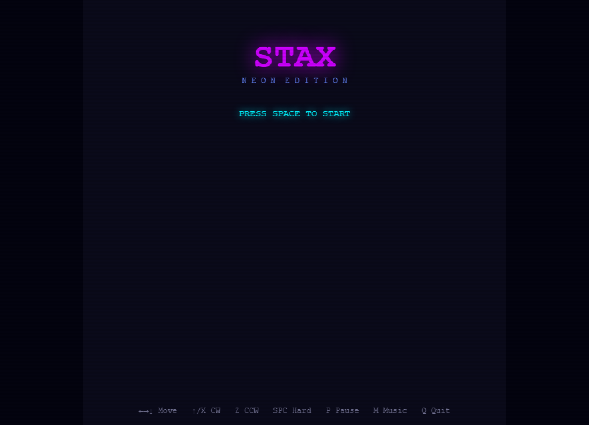

# STAX: Neon Edition

STAX: Neon Edition is a fast-paced, addictive falling-block puzzle game inspired by classic titles, but with a vibrant neon cyberpunk aesthetic. Built entirely with vanilla HTML, CSS, and JavaScript – no frameworks or build steps needed! Prepare for glowing blocks, a pulsing synth soundtrack, and challenging gameplay.

## Features

*   **Classic Gameplay:** Stack blocks and clear lines to survive as long as possible.
*   **Neon Cyberpunk Theme:** Immerse yourself in a visually striking world with glowing blocks, scanline effects, and a dark, moody color palette.
*   **Guideline Scoring:** Master the art of scoring with single, double, triple, and quad line clears, T-spins (full and mini), Back-to-Back bonuses, and combos.
*   **Level Progression:**  The game gets faster as you progress through 20 levels, increasing the challenge.
*   **Advanced Mechanics:** Includes features like a ghost piece, 3-piece next preview, lock delay, SRS wall kicks, and a 7-bag randomizer for balanced piece distribution.
*   **Synth Soundtrack & SFX:** Enjoy two synthesized BGM tracks — **CLASSIC** (140 BPM) and **DARKNESS** (110 BPM) — that accelerate up to 2× speed as you level up, plus satisfying synth sound effects for every action. Toggle music with **M** and cycle tracks with **N**.
*   **Global Leaderboard:** Scores are tracked on a shared global leaderboard backed by a live server; the game falls back to local browser storage if the server is unreachable.
*   **Security:** Cloudflare Turnstile invisible challenge protects score submission from automated bots.
*   **Visual Effects:**  Experience particle effects on line clears and a flash on level up for added feedback.

## How to Run

**Play Online:** [https://esdavis.dev/stax](https://esdavis.dev/stax) — no setup needed.

### Run Locally

This game requires a simple HTTP server to run due to the use of ES modules. You cannot simply open `index.html` in your browser.

1.  **Open your terminal/command prompt.**
2.  **Navigate to the directory containing the game files.**
3.  **Start a local server:**
    *   **Python:** `python -m http.server 8765`
    *   **Node.js (if installed):** `npx serve` (or `npx http-server`)
4.  **Open your browser and go to:** `http://localhost:8765` (or the address provided by your server).

## Controls

| Action                   | Keys              |
|--------------------------|-------------------|
| Move Left                | Left Arrow / A    |
| Move Right               | Right Arrow / D   |
| Soft Drop                | Down Arrow / S    |
| Hard Drop                | Space             |
| Rotate Clockwise         | Up Arrow / W / X  |
| Rotate Counter-Clockwise | Z                 |
| Pause                    | P / Escape        |
| Toggle Music             | M                 |
| Quit to Menu             | Q                 |
| Cycle Music Track        | N                 |
| Restart                  | R                 |

## File Structure

*   `index.html`: The main HTML file, providing the shell for the game.
*   `style.css`:  CSS stylesheet defining the neon dark theme.
*   `js/pieces.js`:  Defines piece shapes, wall kick tables, and the 7-bag randomizer.
*   `js/engine.js`:  Handles the core game logic: board management, collision detection, gravity, lock delay, and T-spin detection.
*   `js/scoring.js`: Implements the `Scorer` class with all guideline scoring rules.
*   `js/input.js`:  Manages keyboard input with Delayed Auto Shift (DAS).
*   `js/audio.js`:  Uses the Web Audio API to create synth sound effects and schedule the BGM.
*   `js/renderer.js`:  Handles all Canvas 2D drawing, effects, and HUD panels.
*   `js/main.js`:  The main game script that wires everything together and manages the game state.
*   `favicon.svg`: SVG favicon used by the browser tab.
*   `api/app.py`: Flask + SQLite REST API powering the global leaderboard.
*   `api/requirements.txt`: Python dependencies for the API.
